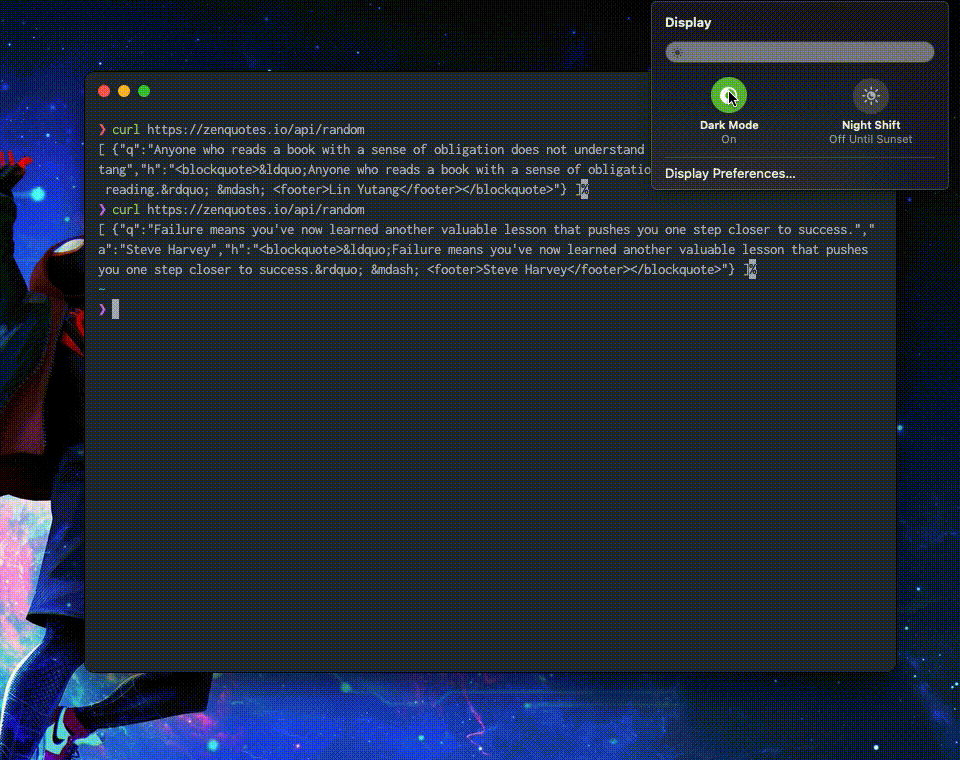

# hyper-auto-detect-theme

> Atom Auto Switch Dark/Light theme for [Hyper][hyper].
> It based on [Hyper Atom One Dark][hyper-one-dark]/[Light][hyper-one-light] theme



## Install

Open your Hyper preferences and add `hyper-auto-detect-theme` to plugin list:

```js
plugins: [
  'hyper-auto-detect-theme'
],
```

or run this command if you have Hyper CLI command in PATH

```bash
hyper i hyper-auto-detect-theme
```

## License

MIT

[hyper]: https://hyper.is
[hyper-one-light]: https://www.npmjs.com/package/hyper-one-light
[hyper-one-dark]: https://www.npmjs.com/package/hyper-one-dark